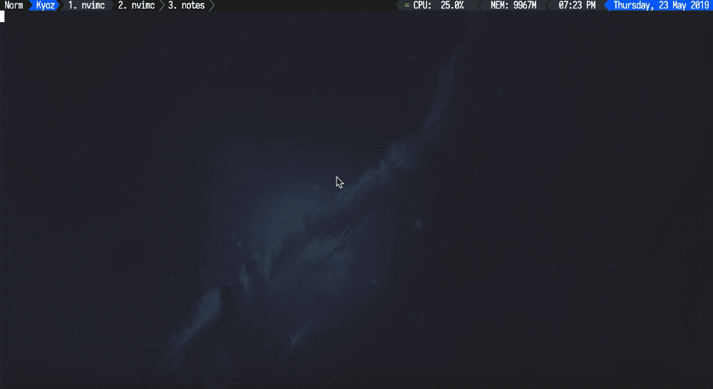

# Kyoz Neovim
> Cool & Modularized vim configurations to work like an IDE

<p align="center">
  
</p>
<p align="center">(Sorry for low quality gif, i'v tried to optimize and reduce the demo.gif size. I'll update it later when i have time)</p>

View [asciinema version](https://asciinema.org/a/UvMbGX98KPuJBpnTu8gOQREch) (without nerd font it look not too good)
   
Currently i'm using [coc.nvim](https://github.com/neoclide/coc.nvim). But there's also a version using [ncm2](https://github.com/ncm2/ncm2), you can [try it here](https://github.com/kyoz/neovim/tree/ncm2).

## Table of contents

* [Introduction](#introduction)
* [Requirements](#requirements)
  * [System](#system)
  * [Neovim](#neovim)
  * [Nodejs](#nodejs)
  * [Providers](#providers)
* [Installation](#installation)
  * [Download](#download)
  * [Install Plugins](#install-plugins)
  * [Fonts](#fonts)
  * [Snippets](#snippets)
  * [Others](#others)
* [Features](#features)
  * [Support Languages](#support-languages)
  * [Plugins](#plugins)
      * [Colors](#colors)
      * [Toolbar](#toolbar)
      * [Finder](#finder)
      * [Navigate](#navigate)
      * [Syntax Hightlight](#syntax-hightlight)
      * [Faster Code](#faster-code)
      * [Beautiful Code](#beautiful-code)
      * [Utils](#utils)
      * [Autocomplete](#autocomplete)
      * [Autocomplete Source](#autocomplete-source)
      * [Autocomplete Supporter](#autocomplete-supporters)
* [Customize](#customize)
  * [Directory Structure](#directory-structure)
      * [Folders](#folders)
      * [Files](#files)
  * [Mappings](#mappings)
      * [General](#general)
      * [Plugins](#plugins)
      * [Autocomplete](#autocomplete)
      * [Language Server Protocol](#language-server-protocol)
* [License](#license)

## Introduction

This's my efforts to create an IDE like with nvim. With cover a lots of great features for coding: syntax, autocomplete, snippets, language server protocol...but with very simple and modularized scripts, which every one can easy understand and config.

<details><summary>My vim story</summary>
<p>

I'v falled in love with Vim in the first time i'v tried it. I love the way i can coding, writing without using mouse or trackpad to move the cursor arround...

In the past, i just use VSCode as my main editor. If Vim doesn't exist in my life, i think VSCode definitely is the best (with me).

There are times i'v quit using Vim cause it's so hard to customize and using, mostly because i can't integrate autocomplete for it. So i give up and back to using VSCode.

But then i'v figure out that i can't life without Vim. I have to install [VSCodeVim](https://github.com/VSCodeVim/Vim) (An extension provide some Vim feature in VSCode). Although it work, but it lack a lot of Vim's features, and it slow down my machine too.

Then i'm back with vim, this time i pay a lots of time to learn, to customize my vimrc. And now, i'm really happy that i can use Vim (Nvim) as my main editor with those configurations. I hope this can help you all too :blush:
</p>
</details>

## Requirements

### System

Those configurations is only for **Neovim**, although most plugins work with **Vim** too, but i'v built this only for **Neovim**.

For **Vim**, i just have some minimal configurations in [my dotfiles](https://github.com/kyoz/dotfiles).

Those configurations work well on almost all OS i'v ever used (OSX, Linux, Window...).

But as it scale, i haven't have times to check it all, for now i just use OSX at home and Linux at work. So i can only make sure it work well on OSX and Linux. If you have any problem with Window please open an issue.

### Neovim

In order to have all the coolest features. You should install [lastest release](https://github.com/neovim/neovim/releases/tag/nightly) (>= 0.4.0) Nvim. Which support some new great features like float window...

### Nodejs

There's a lot of plugins that use external packages (Like language server protocol...). And we do need to install Nvim Node.js provider too. So Nodejs & Npm is needed.

Please [download](https://nodejs.org/en/download/) and install it or you can install it [via package manager](https://nodejs.org/en/download/package-manager/)

### Providers

We have to install python providers (most nvim plugins do need em to work).
Python 2 is no actually required. But some plugin may need it, so just install them all :laughing:

Assume you are using linux:

```sh
# Installing python 2.7 and pip for it
sudo apt install python2.7 python-pip
# Installing python-pip for 3.6
sudo apt install python3-pip

# Install neovim for python 2
pip2 install pynvim
# Install neovim for python 3
pip3 install pynvim
```
Already installed python neovim ? Then upgrade it (Some plugins need latest versions)

```sh
# Upgrade neovim for python 2
pip2 install --upgrade pynvim
# Upgrade neovim for python 3
pip3 install --upgrade pynvim
```

Nvim Node.js client is also needed (for neovim to be able to communicate with plugins). Let install it too:

```sh
npm install -g neovim
```

## Installation

Before starting with this step, you must make sure that you'v read and install everything required in above steps.

And make sure there's no ERROR showing when running `:checkhealth` in nvim.

### Download

Download everything in this repo and put em in the `nvim` folder of yours (Usually it's in `~/.config/nvim`).

Or clone it with git (make sure there no file's in `~/.config/nvim` or that folder does not exist for git to work):

```
git clone git@github.com:kyoz/neovim.git ~/path_to_your_nvim_folder --depth 1

" Example
git clone git@github.com:kyoz/neovim.git ~/.config/nvim --depth 1
```

### Install Plugins

Open nvim and use `:PlugInstall` or `:PlugI` to install all plugins (There will be some error showing when you first running this, just enter to pass them all, and install the plugins).

Quit and re-open nvim and now you have nvim with a lots of feature which can be your main IDE.

### Fonts

In order to make everything look cool as it have to (with vim-arline, nerd-tree icons...), we have to using patched fonts. You can [view some pathced fonts here](https://github.com/ryanoasis/nerd-fonts).

There's a [/fonts](https://github.com/kyoz/neovim/tree/master/fonts/Iosevka) folder with patched Iosevka font, which i'm using now. You can use it too.

I'v tried a lots of fonts, but this Iosevka font seem suitable for me, it's easy to read and doesn't make me lose focus when coding.

### Snippets

I'v use [neosnippet](https://github.com/Shougo/neosnippet.vim) to provide snippets for Vim. You can view all the snippets i have in [snippets/](https://github.com/kyoz/neovim/tree/master/snippets) folder.

Currently i just add some basic snippet with some languages i usually use: html, css, javascript, typescript....

Because i use [Angular](http://angular.io), [Material Components](https://material.angular.io/) and [Flex layout](https://github.com/angular/flex-layout) a lots. I also create [snippets for em too](https://github.com/kyoz/neovim/tree/master/snippets/angular) :blush:. It's super useful.

Just view some examples in my [snippets](https://github.com/kyoz/neovim/tree/master/snippets) and you'll know how to create your own snippets.

### Others

It's hard to cover all the cases when install neovim in each machine, os...

Please run `:checkhealth` in nvim to make sure everything is ok. Follow it's constructions and fix any errors you see.

If there's still error, please open and issue and let me know, i'm happy to help.

## Features

### Support Languages

- Html
- Css, Scss, Sass, Less
- Javascript, Typescript
- Python
- Vimscript
- C, C++ (Not use so much)
- Other files types like: Bash, Dockerfile, Markdown, Json...

**Wait, why there's only a few languages ?**

To provide autocomplete feature, i do use [coc.nvim](https://github.com/neoclide/coc.nvim). There's a lots of extensions (which support for more languages, frameworks, filetypes...)...you can see it all in [coc.nvim's Readme](https://github.com/neoclide/coc.nvim)

**Why not use other autocomplete plugin like [deoplete](https://github.com/Shougo/deoplete.nvim), [ncm2](https://github.com/ncm2/ncm2) ?**

Actually, i'v used deoplete and ncm2 for a long times. It's all work great. But then i know coc.nvim, i really like the way it manage the extensions. With coc's extensions, i can easily add more languages autocomplete, add more useful extenstions without any fear...

There's also a version which using [ncm2](https://github.com/ncm2/ncm2), you can [try it here](https://github.com/kyoz/neovim/tree/ncm2).

### Plugins

#### Colors

| Plugin       | Description                                                   |
|:-------------|:--------------------------------------------------------------|
|[onedark.vim](https://github.com/joshdick/onedark.vim) | Dark color scheme inspired by Atom's One Dark syntax theme |

#### Toolbar

| Plugin       | Description                                                   |
|:-------------|:--------------------------------------------------------------|
|[bling/vim-airline](https://github.com/vim-airline/vim-airline) | Status bar, Tabline |
|[vim-airline/vim-airline-themes](https://github.com/vim-airline/vim-airline-themes) | Vim-Airline Themes |
|[tpope/vim-fugitive](https://github.com/tpope/vim-fugitive) | Just use to show git status in Vim-Airline |

#### Finder

| Plugin       | Description                                                   |
|:-------------|:--------------------------------------------------------------|
|[ctrlpvim/ctrlp.vim](https://github.com/ctrlpvim/ctrlp.vim) | Fuzzy file finder (help jump to other files faster and easier) |
|[mileszs/ack.vim](https://github.com/mileszs/ack.vim) | Do global search in vim with grep (Like global search in VSCode) |

**Note**: I use [ack.vim](https://github.com/mileszs/ack.vim) to provide global search feature for Vim. If you found the the search is slow. You can use [the silver searcher](https://github.com/ggreer/the_silver_searcher) as the search engine for ack.vim.

#### Navigate

| Plugin       | Description                                                   |
|:-------------|:--------------------------------------------------------------|
|[scrooloose/nerdtree](https://github.com/scrooloose/nerdtree) | Nerd Tree (View your folders in tree visualization like in VSCode) |
|[ryanoasis/vim-devicons](https://github.com/ryanoasis/vim-devicons) | Filetype icons for NerdTree |
|[tiagofumo/vim-nerdtree-syntax-highlight](https://github.com/tiagofumo/vim-nerdtree-syntax-highlight) | Colors for NerdTree's icons |
|[easymotion/vim-easymotion](https://github.com/easymotion/vim-easymotion) | Jump around the screen like a boss |

#### Syntax Hightlight

| Plugin       | Description                                                   |
|:-------------|:--------------------------------------------------------------|
|[sheerun/vim-polyglot](https://github.com/sheerun/vim-polyglot) | Syntax for almost all language that exist |
|[leafgarland/typescript-vim](https://github.com/leafgarland/typescript-vim) | Typescript's Syntax |
|[plasticboy/vim-markdown](plasticboy/vim-markdown) | Markdown's Syntax	]
|[ap/vim-css-color](https://github.com/ap/vim-css-color) | Help colorize text color |
|[Valloric/MatchTagAlways](https://github.com/Valloric/MatchTagAlways) | Always highlights the XML/HTML tags that enclose your cursor location |

#### Faster Code

| Plugin       | Description                                                   |
|:-------------|:--------------------------------------------------------------|
|[tmsvg/pear-tree](https://github.com/tmsvg/pear-tree) | Auto pair brackets |
|[alvan/vim-closetag](https://github.com/alvan/vim-closetag) | Auto close html tag |
|[pope/vim-surround](https://github.com/pope/vim-surround) | Auto surround |
|[tpope/vim-commentary](https://github.com/tpope/vim-commentary) | Comment code faster |
|[tpope/vim-repeat](https://github.com/tpope/vim-repeat) | dot repeat with pluggins |
|[Yggdroot/indentLine](https://github.com/Yggdroot/indentLine) | Indent code with v-line |
|[wellle/targets.vim](https://github.com/wellle/targets.vim) | Provides additional text object |
|[terryma/vim-expand-region](https://github.com/terryma/vim-expand-region) | Expand region, Use + and - |
|[mg979/vim-visual-multi](https://github.com/mg979/vim-visual-multi) | Multiple Cursor |
|[mattn/emmet-vim](https://github.com/mattn/emmet-vim) | Emmet for vim |

#### Beautiful Code

| Plugin       | Description                                                   |
|:-------------|:--------------------------------------------------------------|
|[FooSoft/vim-argwrap](https://github.com/FooSoft/vim-argwrap) | Wrap and unwrap function args, list, dicts... |
|[prettier/vim-prettier](https://github.com/prettier/vim-prettier) | Format code |

#### Utils

| Plugin       | Description                                                   |
|:-------------|:--------------------------------------------------------------|
|[NLKNguyen/copy-cut-paste.vim](https://github.com/NLKNguyen/copy-cut-paste.vim) | Copy, Paste with Clipboard |
|[kyoz/ezbuf.vim](https://github.com/kyoz/ezbuf.vim) | Fast and easy use buffers |
|[kyoz/npm.vim](https://github.com/kyoz/npm.vim) | Work with npm more easier in Vim |
|[iamcco/markdown-preview.nvim](https://github.com/iamcco/markdown-preview.nvim) | Markdown Live Preview |

#### Autocomplete

| Plugin       | Description                                                   |
|:-------------|:--------------------------------------------------------------|
|[neoclide/coc.nvim](https://github.com/neoclide/coc.nvim) | Intellisense engine |

## Customize

### Directory Structure

There's no configurations suitable for everyone. Each one have different tastes.

So, in order to easily customize those configuration. You must understand the structural of configuration files.

```
/home/kyoz/.config/nvim
├── autoload/
├── colors/
├── configs/
│   ├── init.vim
│   ├── general.vim
│   ├── indent.vim
│   ├── keys.vim
│   ├── plugins.vim
│   ├── autocomplete.vim
│   └── lsp.vim
├── fonts/
├── snippets/
├── init.vim
└── ginit.vim
```

#### Folders:

| Name      | Meaning                                                          |
|:----------|:-----------------------------------------------------------------|
| autoload/ | Contain autoload `.vim` files (Currently there's only `plug.vim` file cause i'm using [VimPlug](https://github.com/junegunn/vim-plug)) |
| colors/   | Contain vim's color schemes |
| configs/  | Contain all main configurations |
| fonts/    | Contain some patched fonts are ready to use |
| snippets/ | Contain all of mine snippets, which define with [NeoSnippet](https://github.com/Shougo/neosnippet.vim) |

#### Files:

| Name                     | Meaning                                           |
|:-------------------------|:--------------------------------------------------|
| init.vim                 | Run first when nvim start, use this file to link and call other script files (by orders) |
| ginit.vim                | To setting things relate to GUI like fonts, font styles... |
| configs/init.vim         | Definitions all the plugins with [VimPlug](https://github.com/junegunn/vim-plug) |
| configs/general.vim      | Contain all general configurations |
| configs/indent.vim       | Contain all configuration relate to indent |
| configs/keys.vim         | Contain all custom mappings |
| configs/plugins.vim      | Contain all settings of plugins
| configs/autocomplete.vim | Contain all settings relate to autocomplete
| configs/lsp.vim          | Contain all settings relate to language server protocol

### Mappings

#### General

All general custom mappings is place in [configs/keys.vim](https://github.com/kyoz/neovim/blob/master/configs/keys.vim)

Leader key: <kbd>space</kbd>   
Local leader key: <kbd>\\</kbd>

| Mapping                       | Mode | Actions                               |
|:------------------------------|:-----|:--------------------------------------|
| <kbd>jk</kbd>                 | i    | Exist insert mode faster |
| <kbd>dd</kbd>                 | n    | Delete but don't store deleted lines in register |
| <kbd>space</kbd><kbd>z</kbd>  | n    | Save and close current buffer |
| <kbd>gb</kbd>                 | n    | Jump to next buffer |
| <kbd>gB</kbd>                 | n    | Jump to previous buffer |
| <kbd>ctrl</kbd><kbd>h</kbd>   | n    | Resize window (Reduce width) |
| <kbd>ctrl</kbd><kbd>l</kbd>   | n    | Resize window (Expand width) |
| <kbd>ctrl</kbd><kbd>j</kbd>   | n    | Resize window (Reduce height) |
| <kbd>ctrl</kbd><kbd>k</kbd>   | n    | Resize window (Expand height) |

#### Plugins

All plugins custom mappings is place in [configs/plugins.vim](https://github.com/kyoz/neovim/blob/master/configs/plugins.vim)

| Mapping                       | Mode |                                       |
|:------------------------------|:-----|:--------------------------------------|
| <kbd>ctrl</kbd><kbd>p</kbd>   | n | Open Ctrl-P |
| <kbd>space</kbd><kbd>a</kbd>  | n | Start global search with ack.vim |
| <kbd>space</kbd><kbd>b</kbd><kbd>x</kbd>  | n | Close current buffer |
| <kbd>space</kbd><kbd>b</kbd><kbd>X</kbd>  | n | Close all buffers |
| <kbd>space</kbd><kbd>b</kbd><kbd>o</kbd>  | n | Close other buffers |
| <kbd>space</kbd><kbd>b</kbd><kbd>s</kbd>  | n | Close all saved buffers |
| <kbd>space</kbd><kbd>s</kbd>  | n | Start Easymotion |
| <kbd>space</kbd><kbd>S</kbd>  | n | Start Easymotion (two characters) |
| <kbd>space</kbd><kbd>j</kbd>  | n | Start Easymotion (search below rows) |
| <kbd>space</kbd><kbd>k</kbd>  | n | Start Easymotion (search above rows) |
| <kbd>space</kbd><kbd>m</kbd>  | n | Open markdown live preview (When in markdown file buffer) |
| <kbd>space</kbd><kbd>t</kbd>  | n | Toggle NerdTree |
| <kbd>g</kbd><kbd>w</kbd>  | n | Run AirWrap |
| <kbd>,</kbd><kbd>,</kbd>  | n | Run Emmet |
| <kbd>Q</kbd><kbd>C</kbd>  | n | Copy whole line to system clipboard |
| <kbd>Q</kbd><kbd>C</kbd>  | v | Copy selected text to system clipboard |
| <kbd>Q</kbd><kbd>X</kbd>  | n | Cut whole line to system clipboard |
| <kbd>Q</kbd><kbd>X</kbd>  | v | Cut selected text to system clipboard |
| <kbd>Q</kbd><kbd>V</kbd>  | n | Paste from system clipboard |

#### Autocomplete

All autocomplete mappings is place in [configs/autocomplete.vim](https://github.com/kyoz/neovim/blob/master/configs/autocomplete.vim)

| Mapping                       | Mode |                                       |
|:------------------------------|:-----|:--------------------------------------|
| <kbd>tab</kbd>                | i    | Go to next autocomplete candidate |
| <kbd>shift</kbd><kbd>tab</kbd>| i    | Go to previous autocomplete candidate |
| <kbd>ctrl</kbd><kbd>j</kbd>   | i    | Expand snippet (if possible) |

#### Language Server Protocol

All lsp mappings is place in [configs/lsp.vim](https://github.com/kyoz/neovim/blob/master/configs/lsp.vim)

| Mapping                       | Mode |                                       |
|:------------------------------|:-----|:--------------------------------------|
| <kbd>tab</kbd>                | i    | Go to next autocomplete candidate |
| <kbd>g</kbd><kbd>d</kbd>      | n    | View Definition for word under cursor |
| <kbd>g</kbd><kbd>D</kbd>      | n    | View Document Diagnostics |
| <kbd>g</kbd><kbd>h</kbd>      | n    | View LSP Hover result for word under cursor |
| <kbd>g</kbd><kbd>r</kbd>      | n    | Rename for word (variable) under cursor |
| <kbd>g</kbd><kbd>e</kbd>      | n    | Go to next error |
| <kbd>g</kbd><kbd>E</kbd>      | n    | Go to previous error |
| <kbd>g</kbd><kbd>f</kbd>      | n    | Format for current buffer with prettier |

## License

MIT © [Kyoz](mailto:banminkyoz@gmail.com)
