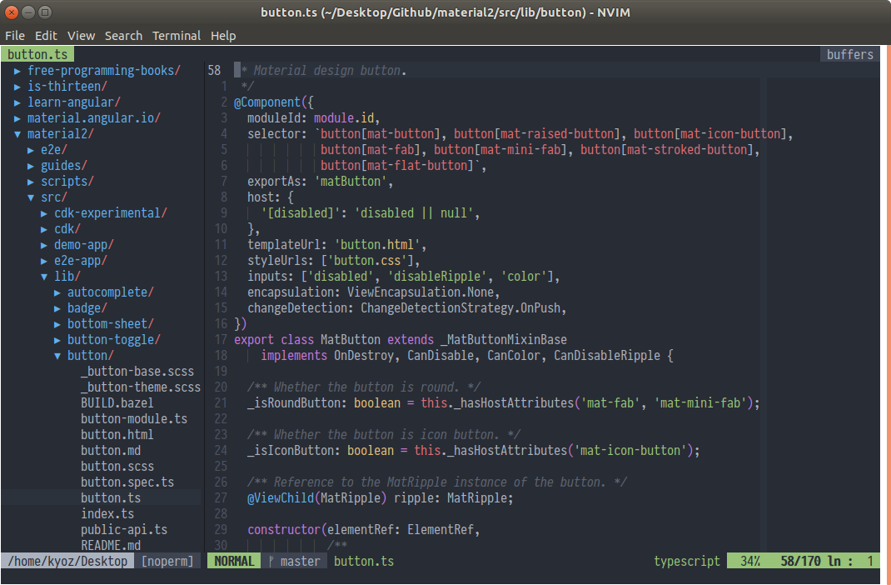

# KYOZ NEOVIM
> Cool & Modularized vim configurations to work like an IDE



---
  * [Introduction](#introduction)
  * [Requirements](#requirements)
  * [Installation](#installation)
    * [Neovim](#neovim)
    * [Nodejs](#nodejs)
    * [Providers](#providers)
    * [Clone Configuration](#clone-configuration)
    * [Install Plugin](#install-plugins)
    * [Fonts](#fonts)
    * [Others](#others)
  * [Features](#features)
    * [Support Languages](#support-languages)
    * [Plugins](#plugins)
  * [Customize](#customize)
    * [Structural](#structural)
    * [Mappings](#mappings)
  * [License](#license)
---

## Introduction

Introduction goes here

## Requirements

Those configurations is only for **Neovim**, although most plugins work with **Vim** too, but i'v built this only for **Neovim**.

For **Vim**, i just have some minimal configurations in [my dotfiles](https://github.com/banminkyoz/dotfiles).

Those configurations work well on almost all OS i'v ever used (OSX, Linux, Window...).

But as it scale, i haven't have times to check it all, for now i just use OSX at home and Linux at work. So i can only make sure it work well on OSX and Linux. If you have any problem with Window please open an issue.

## Installation

### Neovim

In order to have all the coolest features. You should install [lastest release](https://github.com/neovim/neovim/releases/tag/nightly) (>= 0.4.0) Nvim. Which support some new great features like float window...

### Nodejs

There's a lot of plugins that use external packages (Like language server protocol...). And we do need to install Nvim Node.js provider too. So Nodejs & Npm is needed.

Please [download](https://nodejs.org/en/download/) and install it or you can install it [via package manager](https://nodejs.org/en/download/package-manager/)

### Providers

We have to install python providers (most nvim plugins do need em to work).
Python 2 is no actually required. But some plugin may need it, so just install them all :laughing:

Assume you are using linux:

```sh
# Installing python 2.7 and pip for it
sudo apt install python2.7 python-pip
# Installing python-pip for 3.6
sudo apt install python3-pip

# Install neovim for python 2
pip2 install pynvim
# Install neovim for python 3
pip3 install pynvim
```
Already installed python neovim ? Then upgrade it (Some plugins need latest versions)

```sh
# Upgrade neovim for python 2
pip2 install --upgrade pynvim
# Upgrade neovim for python 3
pip3 install --upgrade pynvim
```

Nvim Node.js client is also needed (for neovim to be able to communicate with plugins). Let install it too:

```sh
npm install -g neovim
```

### Clone Configuration

Download everything and put em in the `.nvim` folder of yours. Or clone it with git:

```
git clone git@github.com:banminkyoz/neovim.git ~/path_to_your_nvim_folder

" Example
git clone git@github.com:banminkyoz/neovim.git ~/.config/nvim
```

### Install Plugins

Before starting with this step, you must make sure that you'v read and install everything required in above steps.

And make sure there's no ERROR showing when running `:checkhealth` in nvim.

When everything is ok. Open nvim and use `:PlugInstall` or `:PlugI` to install all plugins (There will be some error showing when you first running this, just enter to pass them all, and install the plugins).

Quit and re-open nvim and now you have nvim with a lots of feature which can be your main IDE.

### Fonts

In order to make everything look cool as it have to (with vim-arline, nerd-tree icons...), we have to using patched fonts. You can [view some pathced fonts here](https://github.com/ryanoasis/nerd-fonts).

There's a `/fonts` folder with patched Iosevka font, which i'm using now. You can use it too.

I'v tried a lots of fonts, but this Iosevka font seem suitable for me, it's easy to read and doesn't make me lose focus when coding.

### Others

It's hard to cover all the cases when install neovim in each machine, os...

Please run `:checkhealth` in nvim to make sure everything is ok. Follow it's constructions and fix any errors you see.

If there's still error, please open and issue and let me know, i'm happy to help.

## Features

### Support Languages

### Plugins

## Customize

### Structural

There's no configurations suitable for everyone. Each one have different tastes.

So, in order to easily customize those configuration. You must understand the structural of configuration files.

```
/home/kyoz/.config/nvim
├── autoload/
├── colors/
├── configs/
│   ├── init.vim
│   ├── general.vim
│   ├── indent.vim
│   ├── keys.vim
│   ├── plugins.vim
│   ├── autocomplete.vim
│   └── lsp.vim
├── fonts/
├── plugged/
├── snippets/
├── init.vim
└── ginit.vim
```

### Mappings

## License

MIT © [Kyoz](mailto:banminkyoz@gmail.com)
